= Document de Conception

Equipe : David Tran, Naria Savary, Pierre Cornu, Raphaël Lamothe

== Table des Matières
* <<Introduction>>
** <<1-Diagrammes des Use Cases>>
** <<2-Descriptions des Use Cases>>
** <<3-Diagramme des classes métier>>
** <<4-Diagrammes de classes de conception>>
* <<Conclusion>>

== Introduction

== 1-Diagrammes des Use Cases

Use Case 1

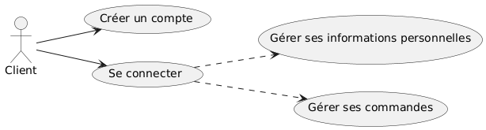

Diagramme de séquence 1

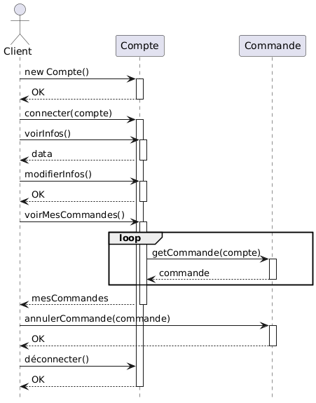

Use Case 2

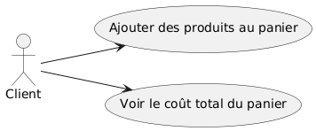

Diagramme de séquence 2

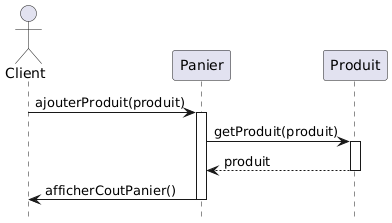

Use Case 3

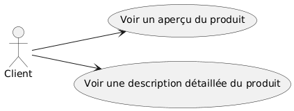

Diagramme de séquence 3

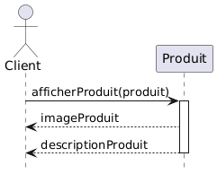

Use Case 4

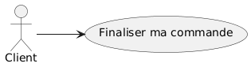

Diagramme de séquence 4

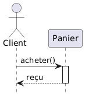

Use Case 5

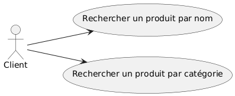

Diagramme de séquence 5

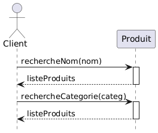

Use Case 6

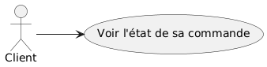

Diagramme de séquence 6

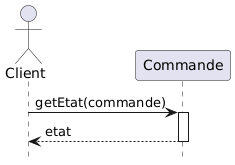

== 2-Descriptions des Use Cases

*Le premier Use Case correspond à la User Story suivante :* +
_En tant que nouveau client, je veux créer un compte facilement, afin de gérer mes informations personnelles et mes commandes._

Le Use Case et la User Story qui lui est associée permet de représenter les actions que le client possède quant à la création d'un compte, et comment celles-ci s'effectuetn dans le programme que nous allons créer.

*Le deuxième Use Case correspond à la User Story suivante :* +
_En tant que client, je veux pouvoir ajouter des produits à mon panier et voir le total en temps réel, afin de mieux gérer mon budget._

Le Use Case et la User Story qui lui est associée permet de représenter comment le client pourra commander les produits, c'est-à-dire à l'aide d'un panier qu'il peut consulter à tout moment, et sur ce même panier le prix total de sa commande avec les produits qu'il a ajouté au panier.

*Le troisième Use Case correspond à la User Story suivante :* +
_En tant que client, je veux voir des photos et des descriptions détaillées des confiseries, afin de prendre une décision éclairée avant d'acheter._

Le Use Case et la User Story qui lui est associée permet de voir comment seront présentés les produits, c'est-à-dire ici avec un aperçu du produit et une description détaillée de ce qu'il contient.

===== *Le quatrième Use Case correspond à la User Story suivante :* +
_En tant que client, je veux pouvoir finaliser ma commande, afin de recevoir mes confiseries._

Le Use Case et la User Story qui lui est associée permet de préciser qu'il est important pour le client de pouvoir commander le produit. Il ne s'agit pas d'un simple catalogue mais d'un site où l'achat est disponible.

*Le cinquième Use Case correspond à la User Story suivante :* +
_En tant que client, je veux pouvoir rechercher des confiseries par nom ou catégorie, afin de trouver rapidement ce que je souhaite acheter._

Le Use Case et la User Story qui lui est associée précise quelles sont les étapes et les caractéristiques nécessaires aux recherches que nous mettrons à disposition de leurs futurs clients.

*Le sixième Use Case correspond à la User Story suivante :* +
_En tant que client, je veux finaliser ma commande en quelques étapes simples, afin de recevoir rapidement mes confiseries._

Ici, il ny'a aucun Use Case, le propos étant de préciser à notre employeur que nous nous occuperons à la suite des recherches, de rendre la page de paiement sobre et claire pour que chaque futur client puisse payer facilement.

*Le septième Use Case correspond à la User Story suivante :* +
_En tant que client, je veux pouvoir suivre l’état de ma commande, afin de savoir quand je vais recevoir mes produits._

Le Use Case et la User Story qui lui est associée permet de représenter comment sera obtenu l'état de la commande du client, qu'il pourra voir sur le site (lorsqu'il regardera ses commandes antécédentes) ou bien dont il sera informé si nous parvenons à créer de quoi informer le client

== 3-Diagramme des classes métier

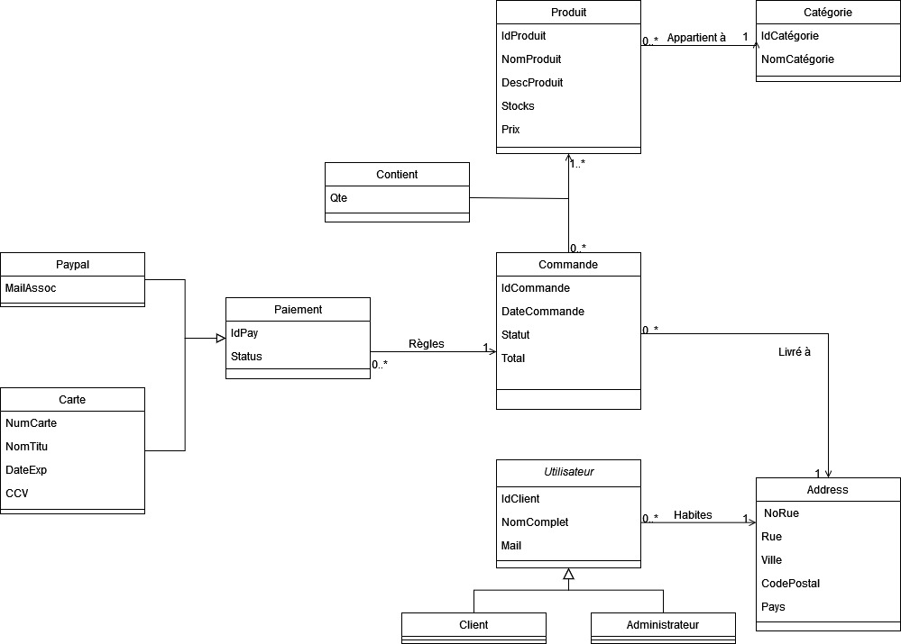

== 4-Diagrammes de classes de conception
=== (Recherche, visualisation et ajout au panier des produits)

Le premier diagramme de classe de conception présenté est celui sur la recherche de produits. 

image::assets/diagramme_classe_conception_recherche.PNG[]

Le deuxième diagramme de classe de conception présenté est celui sur la visualisation des produits.

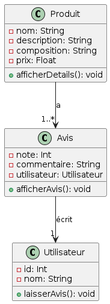

Le troisième diagramme de classe de conception présenté est celui sur l'ajout au panier des produits.

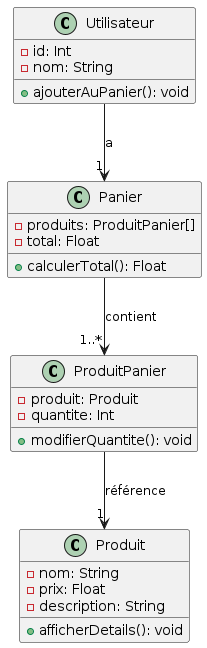

== Conclusion
