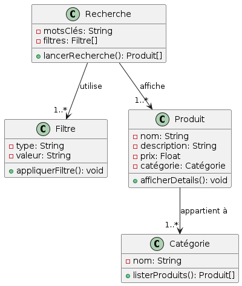

= Document de Conception

Equipe : David Tran, Naria Savary, Pierre Cornu, Raphaël Lamothe

== Table des Matières
* <<Introduction>>
** <<1-Diagrammes des Use Cases>>
** <<2-Descriptions des Use Cases>>
** <<3-Diagramme des classes métier>>
** <<4-Diagrammes de classes de conception>>
* <<Conclusion>>

== Introduction

== 1-Diagrammes des Use Cases

Use Case 1

Diagramme de séquence 1

image::assets/DiagrammeSequence1.png[]

Use Case 2

image::assets/UseCase2.png[]

Diagramme de séquence 2

image::assets/DiagrammeSequence2.png[]

Use Case 3

image::assets/UseCase3.png[]

Diagramme de séquence 3

image::assets/DiagrammeSequence3.png[]

Use Case 4

Diagramme de séquence 4

image::assets/DiagrammeSequence4.png[]

Use Case 5

Diagramme de séquence 5

image::assets/DiagrammeSequence5.png[]

Use Case 6

image::assets/UseCase6.png[]

Diagramme de séquence 6

== 2-Descriptions des Use Cases

== 3-Diagramme des classes métier

image::assets/diagramme_classe_metiers.jpg[]

== 4-Diagrammes de classes de conception
=== (Recherche, visualisation et ajout au panier des produits)

Le premier diagramme de classe de conception présenté est celui sur la recherche de produits. 

Le deuxième diagramme de classe de conception présenté est celui sur la visualisation des produits.

image::assets/diagramme_classe_conception_visualisation.PNG[]

Le troisième diagramme de classe de conception présenté est celui sur l'ajout au panier des produits.

== Conclusion
